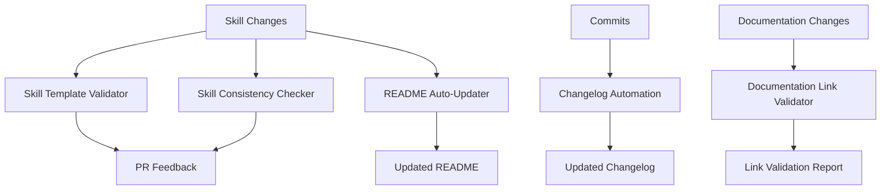

# 🤖 GitHub Actions for Repository Maintenance

This directory contains **5 simple but powerful GitHub Actions** that help maintain the quality and consistency of your Claude Code skills repository.

## 🚀 Available Workflows

### 1. **Skill Template Validator** 
**File**: `skill-template-validator.yml`
- **Purpose**: Ensures new skills follow the established template structure
- **Trigger**: PRs that add/modify skills, manual dispatch
- **Checks**:
  - ✨ Required files (SKILL.md, README.md)
  - 📋 Proper section structure (Purpose, Usage, Examples)
  - 🎯 Skill invocation patterns (`/skill-name`)
  - ⚡ Token efficiency mentions
  - 📖 YAML frontmatter validation

**Usage**:
```bash
# Manual trigger
gh workflow run skill-template-validator.yml
```

### 2. **README Auto-Updater**
**File**: `readme-auto-update.yml`
- **Purpose**: Automatically update main repository README with skill inventory
- **Trigger**: Push to main branch, skill additions/modifications, weekly schedule
- **Features**:
  - 📊 Scans skills directory structure
  - 🏷️ Updates skills inventory section in README
  - 📈 Adds skill counts and categorization
  - 🔄 Maintains consistent formatting

**Usage**:
```bash
# Manual trigger
gh workflow run readme-auto-update.yml

# Add markers to your README.md:
# <!-- SKILLS_INVENTORY_START -->
# <!-- SKILLS_INVENTORY_END -->
```

### 3. **Changelog Automation**
**File**: `changelog-automation.yml`
- **Purpose**: Maintain automatic changelog based on commits and skill changes
- **Trigger**: Push to main, PR merges, manual dispatch with version
- **Features**:
  - 📝 Generates entries from conventional commit messages
  - 🏷️ Categorizes changes (skills, docs, bug fixes, features)
  - 📅 Automatic version calculation
  - 🚀 Creates GitHub releases

**Usage**:
```bash
# Auto-generate changelog
gh workflow run changelog-automation.yml

# Create release with specific version
gh workflow run changelog-automation.yml -f version="3.1.0" -f release_type="minor"
```

### 4. **Skill Consistency Checker**
**File**: `skill-consistency-checker.yml`
- **Purpose**: Ensure consistency across all skills
- **Trigger**: Weekly schedule, PRs, manual dispatch
- **Checks**:
  - ✏️ Naming convention consistency (kebab-case, snake_case, etc.)
  - 📁 File structure standardization
  - 🎯 Quality scoring (0-100% based on required elements)
  - 🔗 Dependency analysis and circular reference detection
  - 📊 Cross-skill compatibility

**Usage**:
```bash
# Run consistency check
gh workflow run skill-consistency-checker.yml
```

### 5. **Documentation Link Validator**
**File**: `documentation-link-validator.yml`
- **Purpose**: Check for broken links in documentation
- **Trigger**: PRs affecting docs, weekly schedule
- **Validates**:
  - 🔍 Internal links to other documentation files
  - 🌐 External URLs for accessibility
  - 📧 Special links (mailto, tel)
  - ⚓ Anchor links within documents

**Usage**:
```bash
# Check all documentation links
gh workflow run documentation-link-validator.yml
```

## 📋 Quick Setup Guide

### 1. **Add Skills Section Markers to README**
Add these markers to your `README.md` where you want the auto-generated skills inventory:

```markdown
<!-- SKILLS_INVENTORY_START -->
<!-- SKILLS_INVENTORY_END -->
```

### 2. **Configure Repository Secrets** (Optional)
These workflows work out-of-the-box, but you can add these secrets for enhanced functionality:

```yaml
# Optional - for external integrations
SLACK_WEBHOOK: ${{ secrets.SLACK_WEBHOOK }}  # For notifications
CUSTOM_GITHUB_TOKEN: ${{ secrets.CUSTOM_GITHUB_TOKEN }}  # For cross-repo operations
```

### 3. **Customize Workflow Behavior** (Optional)
Each workflow can be customized by editing the environment variables at the top of each file:

```yaml
env:
  PYTHON_VERSION: '3.11'
  TEST_TIMEOUT: '300'
  MAX_RETRIES: '3'
```

## 🎯 Workflow Integration

### **For Daily Development**
- **Skill Template Validator**: Runs automatically on PRs
- **Documentation Link Validator**: Runs on PRs and weekly
- **Skill Consistency Checker**: Weekly automated checks

### **For Release Management**
- **Changelog Automation**: Manual trigger for releases
- **README Auto-Updater**: Automatic on main branch pushes

### **For Quality Assurance**
- All workflows run on schedule and provide detailed reports
- Failed checks block PRs (configurable)
- Comprehensive artifacts uploaded for review

## 📊 Workflow Performance

| Workflow | Typical Runtime | Resource Usage | Trigger Frequency |
|----------|----------------|----------------|-------------------|
| Skill Template Validator | 1-2 minutes | Low | On PRs |
| README Auto-Updater | 2-3 minutes | Low | On push + weekly |
| Changelog Automation | 1-2 minutes | Low | On push + manual |
| Skill Consistency Checker | 3-5 minutes | Medium | Weekly + PRs |
| Documentation Link Validator | 5-10 minutes | Medium | Weekly + PRs |

## 🔧 Troubleshooting

### **Common Issues**

1. **Workflow fails with "No changes detected"**
   - This is normal if no actual changes are needed
   - Check the workflow logs for detailed analysis

2. **Link validation finds too many broken links**
   - Some external sites may block automated requests
   - Check if links work in browser (may be false positives)
   - Consider adding domains to allowlist

3. **Skill template validation fails**
   - Ensure your skills follow the template structure
   - Check for required sections: Purpose, Usage, Examples
   - Add token efficiency mentions for Claude skills

### **Debug Mode**
Enable debug logging by adding these secrets to your repository:
```yaml
ACTIONS_STEP_DEBUG: true
ACTIONS_RUNNER_DEBUG: true
```

## 📈 Benefits

### **Quality Assurance**
- ✅ Consistent skill documentation
- ✅ Working documentation links
- ✅ Standardized file structures
- ✅ Automated quality scoring

### **Maintenance Automation**
- 🤖 Auto-updated README inventory
- 📝 Automatic changelog generation
- 🔍 Regular consistency checks
- 📊 Comprehensive reporting

### **Developer Experience**
- 🎯 PR feedback on skill quality
- 📋 Clear validation results
- 🔄 Automated maintenance tasks
- 🚀 Streamlined release process

## 🔄 Workflow Dependencies



## 🆘 Getting Help

### **Workflow Issues**
1. Check the workflow logs in GitHub Actions tab
2. Verify file paths and repository structure
3. Ensure proper permissions are set
4. Review the troubleshooting section above

### **Skill Template Issues**
1. Compare your skill with existing valid skills
2. Check for required sections and formatting
3. Ensure proper YAML frontmatter if used
4. Verify token efficiency mentions

### **Link Validation Issues**
1. Test suspicious links manually in browser
2. Check for temporary network issues
3. Verify external sites aren't blocking requests
4. Consider if links are actually false positives

---

## 📚 Additional Resources

- [GitHub Actions Documentation](https://docs.github.com/en/actions)
- [Workflow Syntax Reference](https://docs.github.com/en/actions/using-workflows/workflow-syntax-for-github-actions)
- [Python GitHub Actions](https://github.com/actions/setup-python)
- [Repository Maintenance Best Practices](https://docs.github.com/en/repositories/managing-your-repositorys-settings-and-features)

---

**Made with ❤️ for the Claude Code community**

**Last Updated**: $(date +%Y-%m-%d)
**Version**: 1.0.0